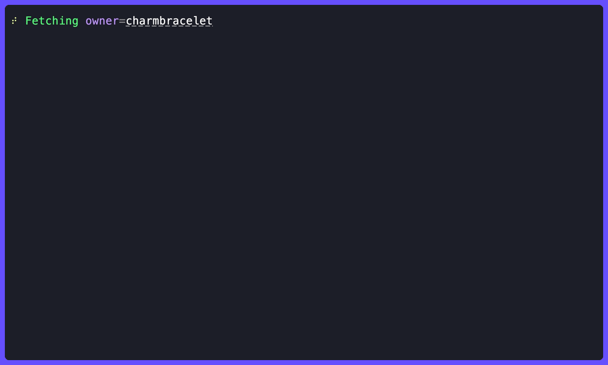
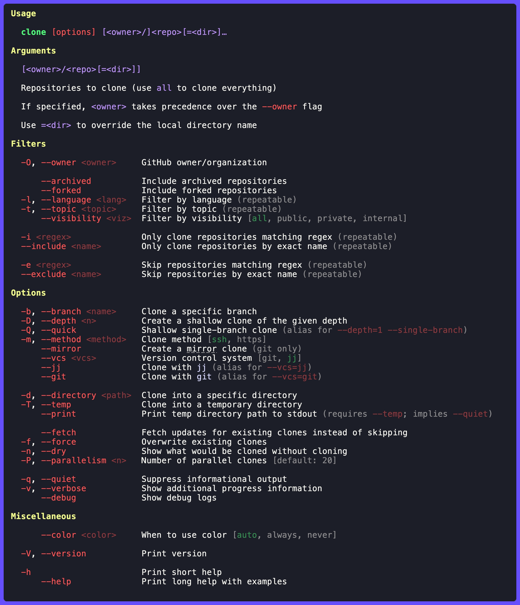

# clone

Clone GitHub repositories in parallel.



## Install

```shell
brew install gechr/tap/clone
```

Or with Go:

```shell
go install github.com/gechr/clone@latest
```

## Usage



### Filters

| Flag                      | Description                                                             |
| ------------------------- | ----------------------------------------------------------------------- |
| `-O`, `--owner <owner>`   | GitHub owner/organization (default: `CLONE_OWNER` or current `gh` user) |
| `--archived`              | Include archived repositories                                           |
| `--forked`                | Include forked repositories                                             |
| `-l`, `--language <lang>` | Filter by primary language (repeatable, matches any)                    |
| `-t`, `--topic <topic>`   | Filter by topic (`a,b` = `AND`, `a/b` = `OR`, repeated flags = `AND`)   |
| `--stars <expr>`          | Filter by star count (e.g. `5`, `>=5`, `<10`, `5..50`)                  |
| `--visibility <type>`     | Filter by visibility (`all`, `public`, `private`, `internal`)           |
| `-i <regex>`              | Only clone repositories matching regex (repeatable)                     |
| `--include <name>`        | Only clone repository by exact name (repeatable)                        |
| `-e <regex>`              | Skip repositories matching regex (repeatable)                           |
| `--exclude <name>`        | Skip repository by exact name (repeatable)                              |

### Clone options

| Flag                    | Description                                                                                                                             |
| ----------------------- | --------------------------------------------------------------------------------------------------------------------------------------- |
| `-b`, `--branch <name>` | Clone a specific branch                                                                                                                 |
| `-D`, `--depth <n>`     | Create a shallow clone of the given depth                                                                                               |
| `-Q`, `--quick`         | Shallow single-branch clone (`--depth=1 --single-branch`)                                                                               |
| `--fetch`               | Fetch updates for existing clones instead of skipping                                                                                   |
| `--pull`                | Pull updates for existing clones (`git pull --rebase`; `jj` behaves like `--fetch`). Combine with `--force` for `--rebase --force`      |
| `--method <type>`       | Clone method (`ssh`, `https`; default: `ssh`)                                                                                           |
| `--forge <forge>`       | Forge for bare `owner/repo` args (`github`, `gitlab`, `sourcehut`, `codeberg`, `bitbucket`, or a hostname; default: `github`)            |
| `--mirror`              | Create a [mirror](https://docs.github.com/en/repositories/creating-and-managing-repositories/duplicating-a-repository) clone (git only) |
| `--vcs <type>`          | Version control system (`git`, `jj`; overrides `CLONE_VCS`)                                                                             |

### Output

| Flag                       | Description                                                                |
| -------------------------- | -------------------------------------------------------------------------- |
| `-d`, `--directory <path>` | Clone into a specific directory                                            |
| `-T`, `--temp`             | Clone into a temporary directory                                           |
| `--print`                  | Print temp directory path to stdout (requires `--temp`; implies `--quiet`) |
| `-f`, `--force`            | Overwrite existing clones                                                  |
| `-n`, `--dry`              | Show what would be cloned without cloning                                  |
| `-P`, `--parallelism <n>`  | Number of parallel clones (default: `20`)                                  |
| `-q`, `--quiet`            | Suppress informational output                                              |
| `-v`, `--verbose`          | Show verbose output                                                        |
| `--color <when>`           | When to use color (`auto`, `always`, `never`)                              |

## Environment variables

| Variable       | Description                                                       |
| -------------- | ----------------------------------------------------------------- |
| `CLONE_FORGE`  | Default forge, overridden by `--forge`                            |
| `CLONE_METHOD` | Default clone method (`ssh` or `https`), overridden by `--method` |
| `CLONE_OWNER`  | Default owner/organization, overridden by `--owner`               |
| `CLONE_VCS`    | Default VCS (`git` or `jj`), overridden by `--vcs`                |

## Examples

```sh
# Clone a specific repository
clone owner/repo

# Clone multiple repositories
clone owner/repo-one owner/repo-two

# Clone all Go repositories
clone --language=Go

# Clone repos that have both topics
clone -t backend,cli

# Same AND logic using repeated flags
clone -t backend -t cli

# Clone repos that have either topic
clone -t backend/cli

# Mixed logic: must have api, and either backend or platform
clone -t backend/platform,api

# Quick shallow clone (no history, default branch only)
clone --quick owner/repo

# Clone into a custom directory name
clone owner/repo=local-dir

# Clone all repositories from a different owner
clone -O other-owner all

# Clone into a specific directory
clone -d ~/projects/go --language=Go

# Clone a specific branch with shallow depth
clone --branch=main --depth=1 owner/repo

# Clone using HTTPS instead of SSH
clone --method=https owner/repo

# Clone from a GitHub URL
clone https://github.com/owner/repo

# Clone a pull request (checks out the PR branch)
clone https://github.com/owner/repo/pull/21

# Clone a PR using shorthand
clone owner/repo#21

# Clone from an SSH URL
clone git@github.com:owner/repo.git

# Fetch existing repos, clone new ones
clone --fetch --language=Go
```

## Pull requests

PR references (`owner/repo#N` or a `/pull/N` URL) clone the repository and check out the PR's head branch.

- **Single same-repo open PR**: uses `--branch` directly (no extra fetch)
- **Cross-repo, closed, or merged PRs**: fetches `refs/pull/N/head` after clone
- For `jj`: imports via `jj git import` then creates a new change with `jj new`

`--branch` and `--mirror` cannot be combined with PR references.

## [Jujutsu](https://jj-vcs.github.io/jj) support

With `--vcs=jj` (or `CLONE_VCS=jj`), clone performs a two-step process:

1. `git clone` (for progress reporting and compatibility)
2. `jj git init --colocate` (to initialize `jj` in the cloned repo)

`--mirror` is not supported with `jj`.
